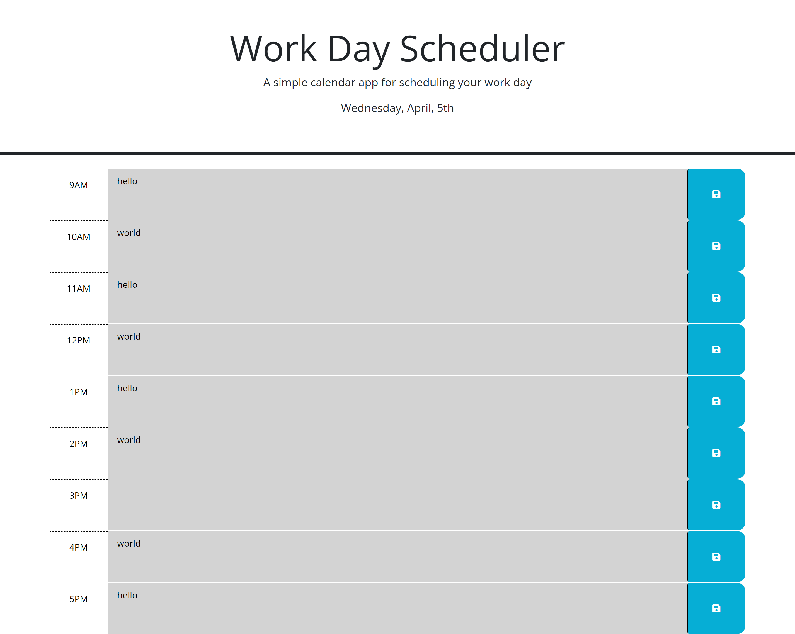

# Work-Day-Scheduler

## Description

This project uses Dayjs, localStorage, jquery and bootstrap.
Dayjs is used to show the current date in the header and used to check whether or not a timeblock is past, present or future.

Localstorage is used to save the input from the user so that it can displayed if the page is refreshed or closed, then reopened.

Jquery for traversing the DOM, and adding on click event

Bootstrap was part of the source code, used to style the page

## Usage

At the top of the page, you will find the current date

The webpage will have time blocks from 9am to 5pm, currently it's 6:53pm so all time blocks are colored gray which is the past, red is present and green is future. Text is typed in the middle column and to save the text to localstorage, click on the blue button on the right side.

(sample text is saved on the page).

Deployed URL: https://timebytes.github.io/Work-Day-Scheduler/

## Credit

Source code from University of Toronto gitlabs repo
https://utoronto.bootcampcontent.com/utoronto-bootcamp/UTOR-VIRT-FSF-PT-02-2023-U-LOLC/-/tree/main/05-Third-Party-APIs/02-Challenge

Advanced format for dayjs, had to change the "utc" to "advancedFormat"
https://day.js.org/docs/en/plugin/loading-into-browser

## License

MIT License
